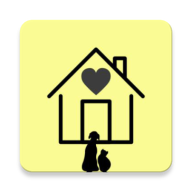
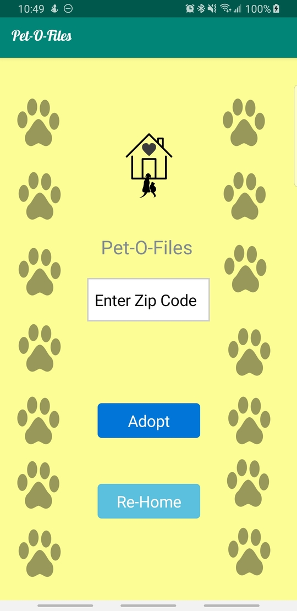
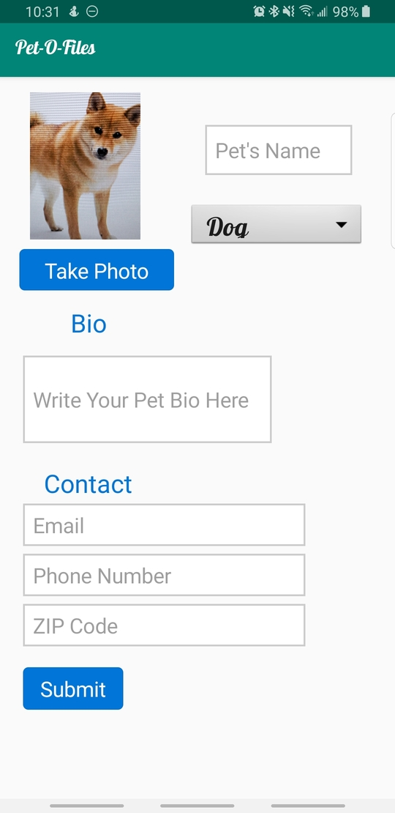
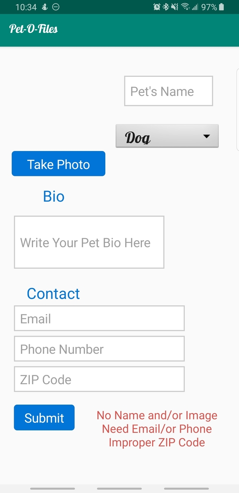
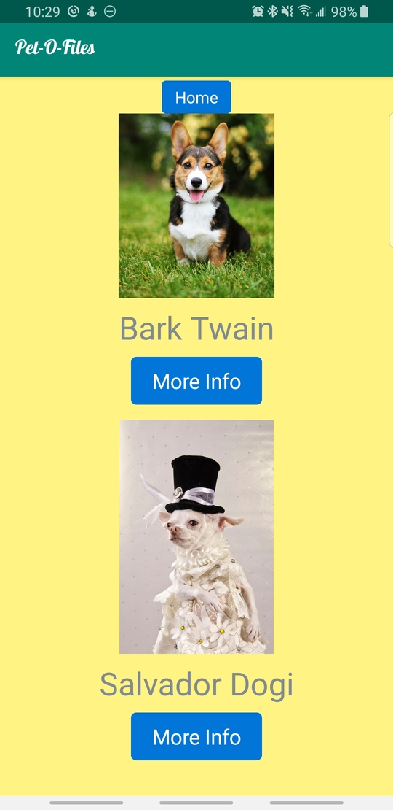

# Pet-O-Files 

## Details
Android Mobile Application where a user can put their pet up for adoption or adopt a pet. 

## Features

Features include:
* Creating an online profile for the pet to be adopted
* Search through a list of potential pets by area code
* Contacting other users to inquire about their potential pet

## Reason
We created this app to help pets find a new home. The occupancy in animal shelters has increased and this
app would be ideal for shelters to show off their animals. 

## Home Page

Here a user may enter their zipcode and tap the Adopt button to find animals for adoption in their area.

A user may also tap the Re-Home button to create a profile for their pet to be adopted.

## Profile

Here a user may take a photo of their animal by tapping the Take Photo button.

A user may:
* Enter their Pet's Name
* Use the dropdown menu to select their Pet's Type
* Enter their Email
* Enter their Phone Number
* Enter their ZIPCode

If a user fails to enter a Pet Name, Image, valid ZIP Code, or At least one contact detail this will result in an error.

Once a user taps the Submit button they will be prompted back to the Home Page.

## Pet Adoption

To adopt a pet a user enters their ZIPCode and taps the Adopt button from the Home Page.

The Pet Adoption page then displays all pets that are up for adoption in that area. 

To see the Owner's Contact Information as well as the Pet's Type and Bio the user may tap the More Info button

To hide the Pet Bio, Type and Contact Information a user may tap Back.

A user may tap the Home button at any time to return to the Home page.

## Challenges
* **Recycler View**
  - One of our many challenges trying to complete this app was trying to get the Recycler view to show our items. We also wanted to make the recycler view clickable, when a click occurred the data of the pet would open on a new fragment to reveal all the pet's info. After around ten attempts spanning three days, we were successful at not making the recycler view do what we originally planned. At this point we decided to turn this into a feature! Who has time to select and item wait microseconds for a new fragment to display when you can just refresh the fragment you already have! We then decided to implement expandable and collapsible recycler view items the only way we knew how to by using visibility.
