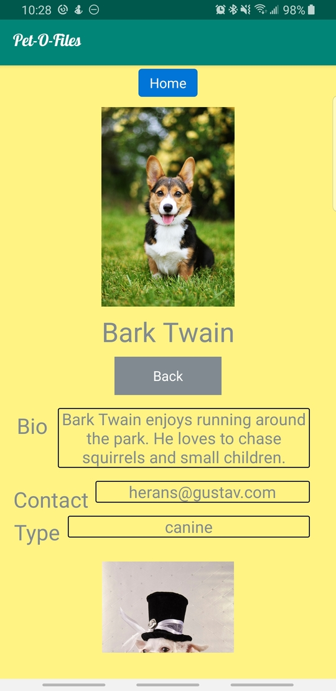

# Pet-O-Files 

## Contributors

Kristen Marenco 
Roman Arias 
Luis Gonzalez
Cristian Corrales

## Details
Android Mobile Application where a user can put their pet up for adoption or adopt a pet. 

## Features

Features include:
* Creating an online profile for the pet to be adopted
* Search through a list of potential pets by area code
* Contacting other users to inquire about their potential pet

## Reason
We created this app to help pets find a new home. The occupancy in animal shelters has increased and this
app would be ideal for shelters to show off their animals. 

## Home Page

Here a user may enter their zipcode and tap the Adopt button to find animals for adoption in their area.

A user may also tap the Re-Home button to create a profile for their pet to be adopted.

## Profile

Here a user may take a photo of their animal by tapping the Take Photo button.

A user may:
* Enter their Pet's Name
* Use the dropdown menu to select their Pet's Type
* Enter their Email
* Enter their Phone Number
* Enter their ZIPCode

If a user fails to enter a Pet Name, Image, valid ZIP Code, or At least one contact detail this will result in an error.

Once a user taps the Submit button they will be prompted back to the Home Page.

## Pet Adoption

To adopt a pet a user enters their ZIPCode and taps the Adopt button from the Home Page.

The Pet Adoption page then displays all pets that are up for adoption in that area. 

To see the Owner's Contact Information as well as the Pet's Type and Bio the user may tap the More Info button

To hide the Pet Bio, Type and Contact Information a user may tap Back.

A user may tap the Home button at any time to return to the Home page.

## Challenges
* **Recycler View**
  - One of our many challenges trying to complete this app was trying to get the Recycler view to show our items. We also wanted to make the recycler view clickable, when a click occurred the data of the pet would open on a new fragment to reveal all the pet's info. After around ten attempts spanning three days, we were successful at not making the recycler view do what we originally planned. At       this point we decided to turn this into a feature! Who has time to select and item wait microseconds for a new fragment to display when you can just refresh the fragment you already have! We then decided to implement expandable and collapsible recycler view items the only way we knew how to by using visibility.

* **Firebase**
  - Firebase was a difficult challenge to impleement as it was something we did not cover so it was brand new for us.
The first challenge we enctountered was trying to retrieve some pre existing data from firebase. We first tried
retrieving te information from the databse whenever we open our fragment that shows our pets, for some odd reason,
the data would not get retrieved up until after the recycler view will try to show the items, this will cause in 0
items to display as there were no items retrieved from the firebase. We fixed this by making a global variable array
that retrieves the data from firebase as soon as the app opens up. With this, we decided to have a class "PetAdapter"
that is dedicated to handling the information from the database.
  - Another issue we encountered was trying to retrieve pictures from firebase. With that, we had to learn how to use
firebase storage and learn how to retrieve an Uri from firebase and be able to display it in our recycler view.
The difficult part here was trying to figure out which library will work best with our app as there are multiple
ways to retrieve an image from firebase storage. We tried multiple times by using Swift UI but it took us a while
to realize that Swift UI works with activities and we were using a fragment. After much more research we found a
library called Picasso which worked flawlessly with our app.
  - The third issue we encountered was trying to upload pictures from the phone onto firebase. First, we had to figure
out how to use the Android camera to be able to take a photo. This was a challenge in itself because it involed
doing hardware checks and checking for the availability of the camera. Again, this could be done using multiple
methods but only a few worked with our app. Another challenge we faced in this section was retrieving the picture
we just took and uploading it to firebase. We had to learn about internal and external memory to first be able
to save the image into a file. Once we had the file, we got the file's Uri to use for firebase upload but for
some odd reason the Uri retirved from the file did not work. After days of researching, we found it easier to
just stream the file onto firebase instead of trying to retrieve it's Uri.

## Demo Video

